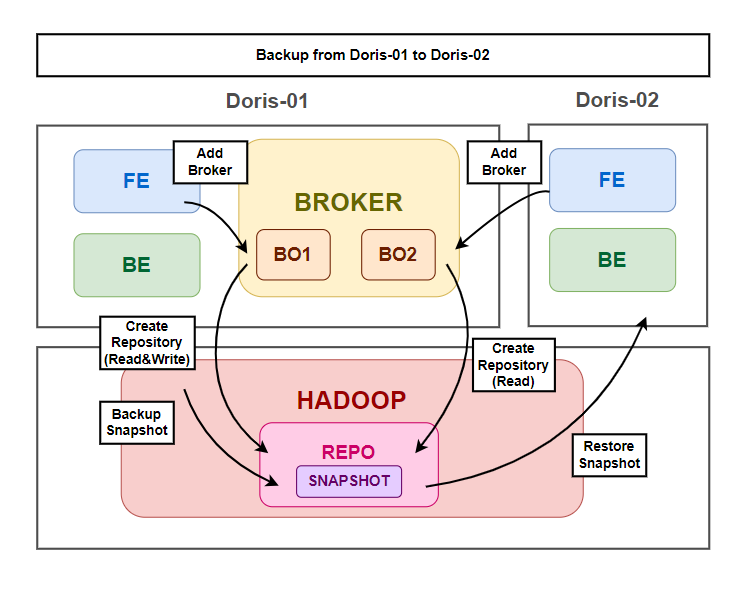

# Doris Backup

Backup table from Doris-01 to Doris-02.  



## Backup(Doris-01)

mySQL command line interface in doris frontend 9030  

use database before all command line.  
```
use {DATABASE_NAME};
```

### Register Broker

use docker compose or sql  

```
ALTER SYSTEM ADD BROKER bo1 "10.1.1.300:8000";
```

check broker  
```
SHOW BROKER;
```

### Create Repository On Hadoop

```
CREATE REPOSITORY `hadoop_repo`
WITH BROKER `bo1`
ON LOCATION "hdfs://hadoop_host:8020"
PROPERTIES
(
   "username" = "hadoop_admin",
   "password" = "hadoop_admin_password"
);
```

check repository
```
SHOW REPOSITORIES;
```

if you want to delete
```
DROP REPOSITORY `hadoop_repo`;
```

### Backup Snapshot

only one backup can be made at the same time  

```
BACKUP SNAPSHOT database.snapshot_01
TO hadoop_repo
ON (
    table1, table2
)
PROPERTIES ("type" = "full");
```

check backup
```
SHOW BACKUP;
```

if you want to cancel
```
CANCEL BACKUP;
```


## Restore(Doris-02)

mySQL command line interface in doris frontend 9030  

### Register Broker

use docker compose or sql  

```
ALTER SYSTEM ADD BROKER bo1 "10.1.1.300:8000";
```

check broker  
```
SHOW BROKER;
```

### Create Repository On Hadoop

```
CREATE READ ONLY REPOSITORY `hadoop_repo`
WITH BROKER `bo1`
ON LOCATION "hdfs://hadoop_host:8020"
PROPERTIES
(
   "username" = "hadoop_admin",
   "password" = "hadoop_admin_password"
);
```

### Restore Snapshot

only one restore can be made at the same time  

```
SHOW SNAPSHOT ON hadoop_repo;
```
find snapshot timestamp and edit below command  
modify replication_num according to your needs  

```
RESTORE SNAPSHOT nexdata.snapshot_01
FROM `hadoop_repo`
ON (
    table1, table2
)
PROPERTIES
(
    "backup_timestamp"=timestamp,
    "replication_num" = "1",
    "reserve_dynamic_partition_enable"="true"
);
```

check restore
```
SHOW RESTORE;
```

if you want to cancel
```
CANCEL RESTORE;
```